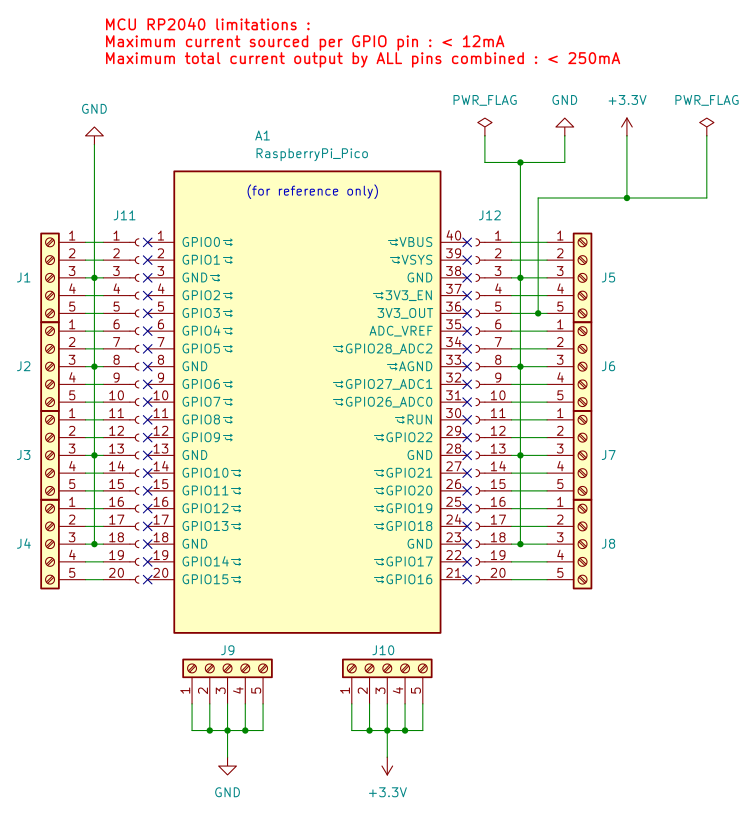
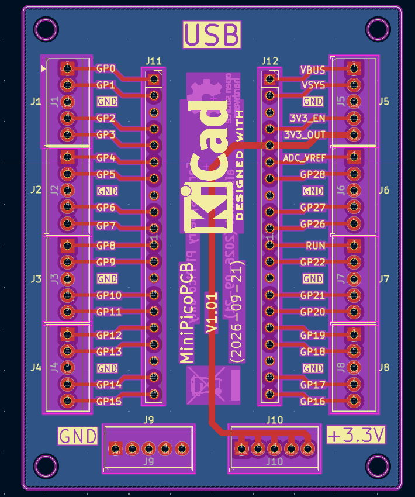
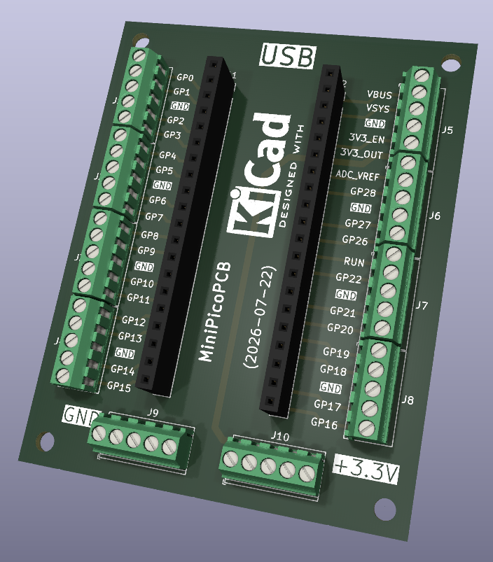

# MiniPicoPCB

A simple PCB for the Raspberry Pi Pico with screw terminal headers (GPIOs, +3.3V, GND) to experiment with students.

## Printed Circuit Board (PCB) :

As part of an educational project, the schematic and PCB are made with [KiCad](https://www.kicad.org) version 9 ([kicad](kicad/) folder).

:bulb: All important parameters are stored in the schematic or PCB editors **text variables**.

Thanks to [AISLER](https://aisler.net) PCB manufacturer :eu:

Useful plugins for KiCad :
* AISLER Push for KiCad : https://github.com/aislerhq
* Interactive HTML BOM : https://github.com/openscopeproject/InteractiveHtmlBom
* Board2Pdf : https://gitlab.com/dennevi/Board2Pdf
* Solarized Dark Theme : https://github.com/pointhi/kicad-color-schemes

Thanks to "Jimmi Henry" for his 3D libraries (including this PCB Terminal Blocks)  in [GRABCAD Community](https://grabcad.com/jimmi.henry-1) in the [kicad/imports](kicad/imports) folder. 

## Bill Of Materials (BOM) :

| Ref  | Qty | Value | Footprint | Description |
| :---: | :---: | :--- | :--- | :--- |
| J1 ⟶ J10  | 10  | Screw_Terminal_01x05 | TerminalBlock_TE-Connectivity:TerminalBlock_TE_282834-5_1x05_P2.54mm_Horizontal | ... |
| J11, J12  | 2  | Conn_01x20_Socket | Connector_PinSocket_2.54mm:PinSocket_1x20_P2.54mm_Vertical | ... |

## TODO :

* Add PDF files for the schematic and PCB to check dimensions

## Documentation :

Raspberry Pi Pico : https://www.raspberrypi.com/products/raspberry-pi-pico/

> [!NOTE]
> Big thanks to the [KiCad](https://www.kicad.org) and plugins communities. :heart:

Happy soldering, coding & have fun ! :partying_face:
